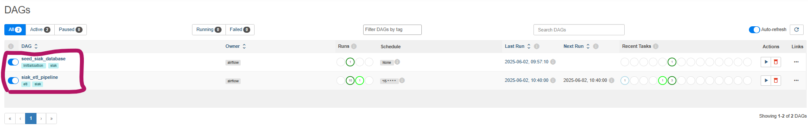

#PROYEK AKHIR BASIS DATA LANJUT

Isa Citra Buana (2206081465)
Muhammad Urwatil Wutsqo (1906351101)
Balqis A. Lumbun (2106751184)

Proyek ini merupakan simulasi dari dashboard SIAK dengan memanfaatkan Docker, PostgreSQL, MINIO, Airflow DAG, dan dashboard menggunakan Next.js

# Cara menggunakan

1. Unduh repositori ini menggunakan command git clone https://gitlab.cs.ui.ac.id/banjut-2025/banjut-2025-kel-1.git 
2. Copy file ".env.example" di direktori yang sama lalu rename file tersebut menjadi ".env"
3. Pastikan anda memiliki Docker di gawai anda, lalu jalankan command "docker compose up --build"
4. Setelah semua container aktif, pergi ke localhost:9090 dan aktifkan otomasi ETL dengan menekan tombol switch seed_siak_database dan siak_etl_pipeline.

5. Pergi ke localhost:3000 untuk melihat tampilan dashboard.